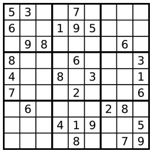

# 有效的数独
判断一个 9x9 的数独是否有效。只需要根据以下规则，验证已经填入的数字是否有效即可。

数字 1-9 在每一行只能出现一次。
数字 1-9 在每一列只能出现一次。
数字 1-9 在每一个以粗实线分隔的 3x3 宫内只能出现一次。
上图是一个部分填充的有效的数独。  
  
数独部分空格内已填入了数字，空白格用 '.' 表示。

示例 1:  
```js
  输入:
  [
    ["5","3",".",".","7",".",".",".","."],
    ["6",".",".","1","9","5",".",".","."],
    [".","9","8",".",".",".",".","6","."],
    ["8",".",".",".","6",".",".",".","3"],
    ["4",".",".","8",".","3",".",".","1"],
    ["7",".",".",".","2",".",".",".","6"],
    [".","6",".",".",".",".","2","8","."],
    [".",".",".","4","1","9",".",".","5"],
    [".",".",".",".","8",".",".","7","9"]
  ]
  输出: true
```
示例 2:  
```js
  输入:
  [
    ["8","3",".",".","7",".",".",".","."],
    ["6",".",".","1","9","5",".",".","."],
    [".","9","8",".",".",".",".","6","."],
    ["8",".",".",".","6",".",".",".","3"],
    ["4",".",".","8",".","3",".",".","1"],
    ["7",".",".",".","2",".",".",".","6"],
    [".","6",".",".",".",".","2","8","."],
    [".",".",".","4","1","9",".",".","5"],
    [".",".",".",".","8",".",".","7","9"]
  ]
  输出: false
```
说明:  

一个有效的数独（部分已被填充）不一定是可解的。  
只需要根据以上规则，验证已经填入的数字是否有效即可。  
给定数独序列只包含数字 1-9 和字符 '.' 。  
给定数独永远是 9x9 形式的。  

## 解答
```js
var isValidSudoku = function(board) {
    let rowObjArr = []; // 使用数组和对象记住每个数字出现的次数。
    let colObjArr = [];
    let boxObjArr = [];
    for(let i = 0; i < 9;i++){
        rowObjArr[i] = {};
        colObjArr[i] = {};
        boxObjArr[i] = {};
    }
    for(let k = 0; k < 9; k++){
        for(let j = 0; j < 9; j++){
            let num = board[k][j];
            let boxIndex = Math.floor(k / 3) * 3 + Math.floor(j / 3);
            if(num !== '.'){
                if(!rowObjArr[k].hasOwnProperty(num)){
                    rowObjArr[k][num] = 1;
                } else {
                    return false;
                }
                if(!colObjArr[j].hasOwnProperty(num)){
                    colObjArr[j][num] = 1;
                }else{
                    return false;
                }
                if(!boxObjArr[boxIndex].hasOwnProperty(num)){
                    boxObjArr[boxIndex][num] = 1;
                } else {
                    return false;
                }
            }
        }
    }
    return true;
};
```